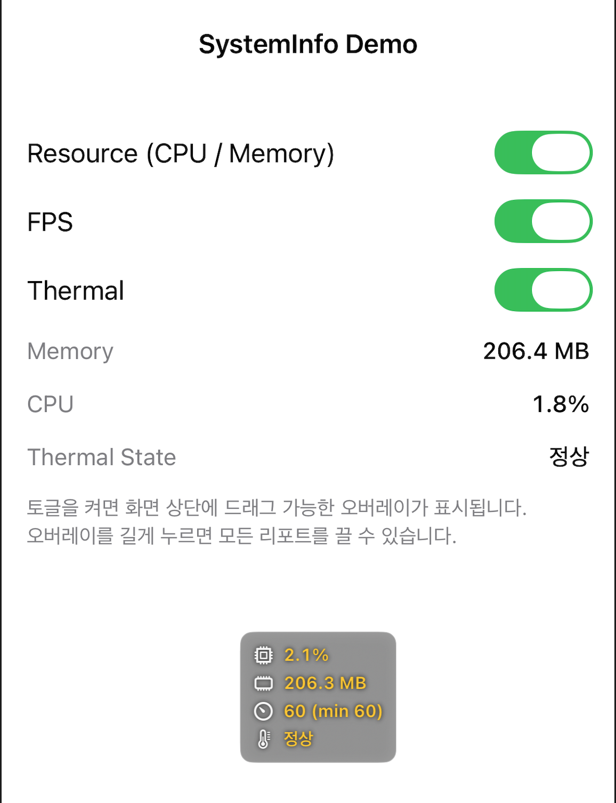

# SystemInfo

iOS 앱에서 CPU, 메모리, FPS, 발열 상태를 오버레이로 확인할 수 있는 Swift Package입니다.

<p align="center">
  
</p>

## 설치

```swift
dependencies: [
    .package(url: "https://github.com/pkh0225/SystemInfo.git", from: "0.1.0"),
],
targets: [
    .target(
        name: "YourApp",
        dependencies: [
            .product(name: "SystemInfo", package: "SystemInfo"),
        ]
    ),
]
```

## 사용법

```swift
import SystemInfo

// 설정 저장
SystemInfoManager.shared.saveUserDefaults()

// 저장된 설정 복원
SystemInfoManager.shared.loadUserDefaults()

// 리포트 on/off
SystemInfoManager.shared.isResourceReport = true
SystemInfoManager.shared.isFpsReport = true
SystemInfoManager.shared.isThermalReport = true

// 발열은 감시와 화면 표시를 따로 켤 수 있습니다.
// false면 오버레이 없이 화면 경고·알럿만 동작합니다.
SystemInfoManager.shared.isThermalOverlayVisible = true
```

`loadUserDefaults()` 는 발열 설정이 저장된 적 없으면 DEBUG 빌드에서 감시만 켭니다.
오버레이는 사용자가 직접 켠 경우(`true` 로 저장된 경우)에만 표시됩니다.

## 테스트

### 단위 테스트

`Package.swift` 를 Xcode에서 연 뒤 `SystemInfoTests` 스킴으로 실행하거나:

```bash
xcodebuild test \
  -scheme SystemInfo \
  -destination 'platform=iOS Simulator,name=iPhone 16' \
  -skipPackagePluginValidation
```

### 데모 앱

수동 UI 테스트는 [Example/README.md](Example/README.md) 를 참고하세요.
